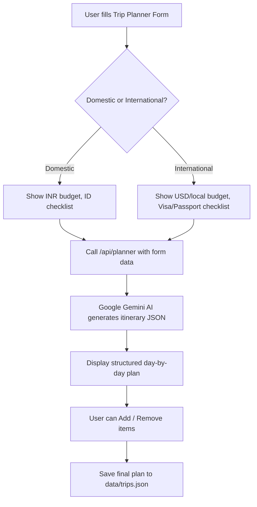

# 🗺️ Smart Itinerary Planner — Implementation Plan

> **Renamed Button:** "Generate Itinerary" → **"Plan My Trip"** (clear, action-oriented)

---

## What We Are Building

A fully functional, real-time trip planner that takes the user's **destination, budget, trip duration, and travel type (domestic/international)** and returns a **structured day-by-day itinerary** broken down into:

- 🏨 Hotels (with nightly cost)
- 🍽️ Food (Breakfast, Lunch, Dinner with estimated cost)
- 🚗 Transport (Car, Metro, etc. with cost + travel time)
- 🏛️ Tourist Places (entry fee, best time)
- 📋 Suggestions (add/remove items)
- ✅ Checklist (visa, passport for international; ID for domestic)

---

## Architecture Overview



---

## Phase-by-Phase Plan

### Phase 1 — Redesign the Planner Form UI

**What to build:**
Replace the current simple text-input with a proper **Trip Planning Form** that collects:

| Field | Type | Notes |
|---|---|---|
| Destination | Text | e.g., "Mumbai" or "Paris, France" |
| Trip Type | Toggle | 🇮🇳 Domestic / 🌍 International |
| Budget (Total) | Number | In ₹ for domestic, $ for international |
| Duration | Number | Days (e.g., 2) |
| Travelers | Number | How many people |
| Start Date | Date | For calendar planning |

**Domestic vs International Detection:**
- If user selects **Domestic** → budget in ₹, show "Government ID" in checklist
- If user selects **International** → budget in $, show "Passport", "Visa", "Travel Insurance", "Foreign Currency" in checklist

---

### Phase 2 — AI Backend Integration (Google Gemini)

**What to build:**
A new API route: `app/api/planner/route.ts`

**How it works:**
1. User submits the form → frontend calls `POST /api/planner`
2. The backend constructs a detailed **prompt** for Google Gemini AI like:
   ```
   Create a detailed 2-day travel plan for Mumbai, India.
   Total budget: ₹10,000 for 1 traveler.
   Break it down day-by-day with: hotel (per night cost), breakfast/lunch/dinner
   (restaurant name + cost), transport options (car vs metro: cost + time),
   top tourist places (entry fee + hours), and leftover budget.
   Return ONLY valid JSON.
   ```
3. Gemini returns a **structured JSON** itinerary
4. The API sends it back to the frontend

**Cost of using Gemini:**
- Google Gemini 1.5 Flash API is **FREE** up to 15 requests/minute
- You just need a **Google AI Studio API Key** (free at [aistudio.google.com](https://aistudio.google.com))
- Store the key in `.env.local` as `GEMINI_API_KEY`

---

### Phase 3 — Display the Itinerary (Day-by-Day View)

**What to build:**
A beautiful timeline UI showing the full plan. Each day will have:

```
📅 Day 1 — Mumbai
  🌅 Morning
    🏨 Hotel: Hotel Residency | ₹1,800/night
    🍳 Breakfast: Idli Sambar at Café Madras | ₹120 | 8:00 AM
    🚌 Transport: Metro to Gateway of India | ₹45 | ~35 min
    🏛️ Gateway of India | Entry: Free | 9:00 AM - 11:00 AM
  ☀️ Afternoon
    🍽️ Lunch: Trishna Restaurant | ₹350 | 12:30 PM
    🚗 Taxi to Elephanta Caves | ₹200 | ~45 min
    🏛️ Elephanta Caves | Entry: ₹40 | 2:00 PM - 4:30 PM
  🌙 Evening
    🛍️ Shopping at Colaba Causeway | ₹500 estimated
    🍽️ Dinner: Leopold Cafe | ₹500 | 8:00 PM

  📊 Day 1 Budget: ₹3,555 / ₹5,000 (₹1,445 remaining)
```

**Key Interactive Features:**
- ➕ **Add** button on each item to add more activities
- ❌ **Remove** button to delete items you don't want
- Budget tracker auto-updates when items are added/removed
- Each item has a **"Swap"** option to get an alternative (e.g., cheaper hotel)

---

### Phase 4 — Checklist Panel (Domestic vs International)

**Domestic Trip Checklist:**
- [ ] Government ID / Aadhaar Card
- [ ] Travel Insurance (optional)
- [ ] Hotel Booking Confirmation
- [ ] Train/Flight Tickets

**International Trip Checklist:**
- [ ] Valid Passport (6+ months validity)
- [ ] Visa Applied / Approved
- [ ] Travel Insurance (mandatory)
- [ ] Foreign Currency Exchanged
- [ ] Flight Tickets Confirmed
- [ ] Hotel Booking Confirmed
- [ ] Emergency Contact Note
- [ ] Travel Adapter (if needed)

---

### Phase 5 — Save to Trip & Persist

Once the user is happy with their plan:
- **"Save This Plan"** button saves the complete itinerary to `data/trips.json` under their account
- The trip then appears on the main Dashboard
- The plan is re-viewable from "My Trips"

---

## File Changes Required

| File | Action | Purpose |
|---|---|---|
| `components/dashboard/ai-planner.tsx` | **Rewrite** | New form + itinerary display UI |
| `app/api/planner/route.ts` | **Create** | Calls Gemini AI and returns itinerary JSON |
| `components/dashboard/itinerary-view.tsx` | **Create** | Day-by-day visual itinerary component |
| `components/dashboard/trip-checklist.tsx` | **Create** | Domestic/international checklist |
| `.env.local` | **Create** | Store `GEMINI_API_KEY` securely |

---

## What You Need First

Before I can build this, you need **one thing**:

> **A free Google Gemini API Key**
> 1. Go to [https://aistudio.google.com/app/apikey](https://aistudio.google.com/app/apikey)
> 2. Sign in with your Google account
> 3. Click **"Create API Key"**
> 4. Copy the key and give it to me
> 5. I will store it in `.env.local` (it will never be committed to Git)

---

## Summary

| Feature | Complexity | Time Estimate |
|---|---|---|
| Phase 1: New Form UI | Low | ~30 min |
| Phase 2: Gemini AI Backend | Medium | ~45 min |
| Phase 3: Day-by-Day Itinerary View | Medium | ~1 hour |
| Phase 4: Checklist | Low | ~20 min |
| Phase 5: Save & Persist | Low | ~20 min |
| **Total** | | **~3 hours** |
